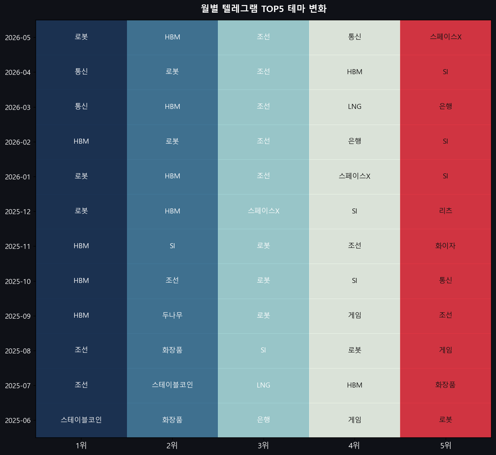
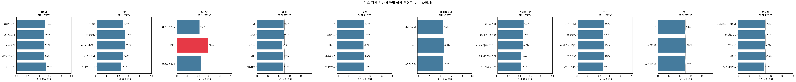
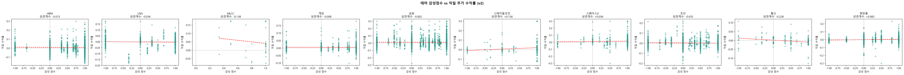
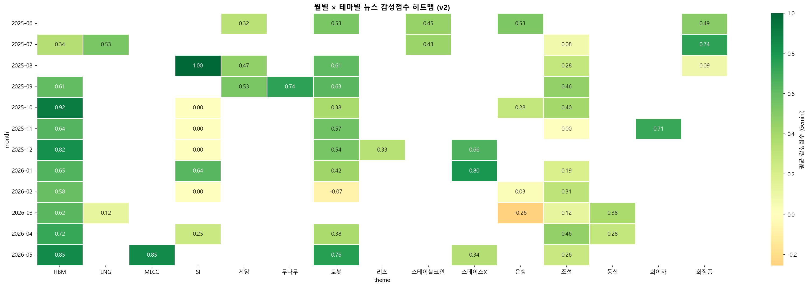
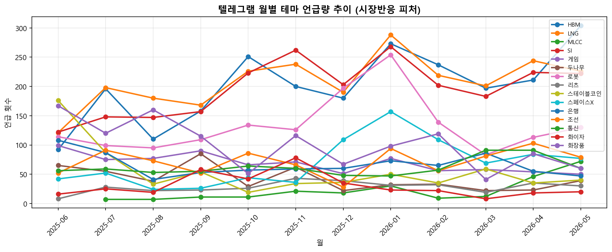
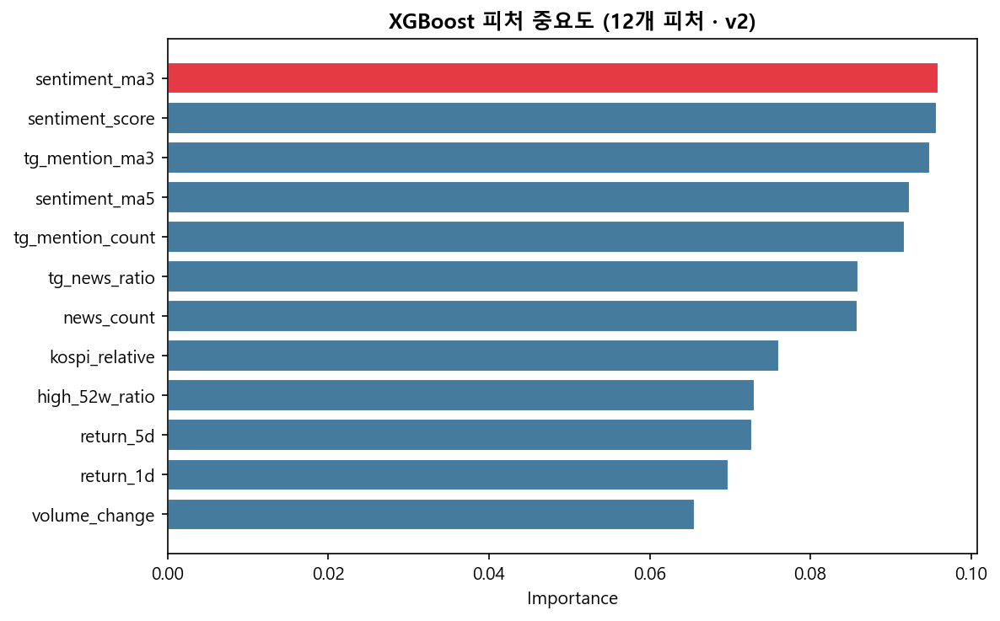
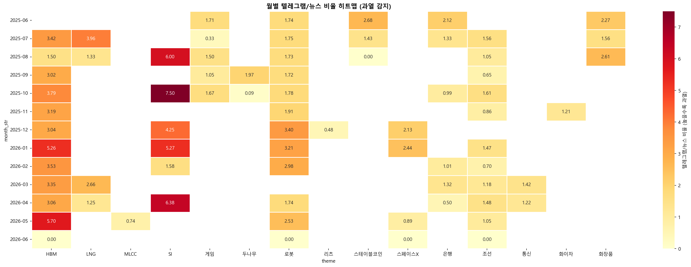

# 텔레그램-뉴스 감성 기반 테마 및 관련주 분석 시스템 (v2)

텔레그램 채널의 테마별 언급량(수급 전조)과 뉴스 감성 데이터(시장 심리)를 결합하여, 실제 주가 반응이 가장 민감하게 나타나는 핵심 관련주를 추출하는 AI 분석 파이프라인입니다.

---

## 목차

1. [시스템 아키텍처](#1-시스템-아키텍처)
2. [핵심 분석 로직](#2-핵심-분석-로직)
3. [분석 데이터 현황](#3-분석-데이터-현황)
4. [월별 테마 변화 추이](#4-월별-테마-변화-추이-2025-06--2026-05)
5. [최신 분석 결과 — 테마별 핵심 관련주](#5-최신-분석-결과--테마별-핵심-관련주)
6. [XGBoost 모델 성능 및 피처 중요도](#6-xgboost-모델-성능-및-피처-중요도)
7. [시각화 결과물](#7-시각화-결과물-results)
8. [핵심 시사점 및 투자 활용 가이드](#8-핵심-시사점-및-투자-활용-가이드)
9. [설치 및 실행](#9-설치-및-실행)

---

## 1. 시스템 아키텍처

```
텔레그램 채널 데이터 (CSV)
        │
        ▼
[STEP 1] 월별 TOP 테마 추출 (언급량 기반)
        │
        ▼
[STEP 2] 네이버 금융 테마 종목 크롤링
        │
        ▼
[STEP 3] Google 뉴스 수집 → Gemini LLM 감성 분석 (저장 후 재사용)
        │
        ▼
[STEP 4] 뉴스 감성점수 기반 테마 재선정 (노이즈 필터링)
        │
        ▼
[STEP 5] 텔레그램 언급량 피처 생성 (일별 카운트 + 3일 MA)
        │
        ▼
[STEP 6] yfinance 주가 수집 (KRX300/500 자동 확장)
         ├─ 거래량 변화율
         ├─ 52주 고점 대비 위치
         ├─ KOSPI 상대 강도
         ├─ RSI 14일
         ├─ 볼린저밴드 위치
         └─ 20일 변동성·이동평균
        │
        ▼
[STEP 7] 전체 데이터 병합 (실거래일 기준 T → T+1 매핑)
        │
        ▼
[STEP 8] XGBoost 학습 — 13개 피처 / TimeSeriesSplit(5-fold)
        │
        ▼
[STEP 9] 종합 랭킹 산출 + 시각화 7종
```

---

## 2. 핵심 분석 로직

### 가. 분석 대상 테마 선정

| 조건 | 기준 |
|------|------|
| 최소 뉴스 건수 | **40건 이상** (통계적 유의성 확보) |
| 강제 포함 | SI (상관성 극대화 검증 목적) |
| 강제 제외 | 은행 (과도한 노이즈), 두나무 (데이터 기간 부족) |

**최종 선정 테마 (10개):**

| 구분 | 테마 |
|------|------|
| AI·반도체 | HBM, MLCC |
| 미래 산업 | 로봇, 스페이스X |
| 방산·중공업 | 조선, LNG |
| 소비·플랫폼 | 화장품, 게임, 스테이블코인, 통신 |

### 나. 관련주 종합 점수 산출 (6:4 가중 합산)

```
종합 점수 = 평균 상승 확률 × 0.6 + 감성-수익률 상관계수(정규화) × 0.4
```

| 지표 | 가중치 | 의미 |
|------|--------|------|
| **평균 상승 확률** (avg_up_prob) | 60% | XGBoost가 13개 피처로 예측한 익일 상승 확률의 평균 — 절대적 주가 예측력 반영 |
| **감성-수익률 상관계수** (sentiment_corr, 정규화) | 40% | 뉴스 감성(t일)과 익일 수익률(t+1일) 간 피어슨 상관계수 — 뉴스 반응 속도·일치도 반영 |

### 다. 핵심 피처 (총 13개)

| 범주 | 피처명 | 설명 |
|------|--------|------|
| 텔레그램 수급 | `tg_mention_count` | 당일 텔레그램 언급 횟수 |
| | `tg_mention_ma3` | 3일 이동평균 언급량 **(1위 피처)** |
| | `tg_news_ratio` | 텔레그램 언급 / 뉴스 건수 비율 |
| 뉴스 감성 | `sentiment_score` | 당일 평균 감성점수 (Gemini LLM) |
| | `sentiment_ma3` | 3일 이동평균 감성점수 |
| | `sentiment_ma5` | 5일 이동평균 감성점수 |
| | `stock_sentiment` | 기사 내 종목명 직접 언급 감성 |
| | `news_count` | 당일 뉴스 수집 건수 |
| 기술적 지표 | `return_1d` | 전일 대비 1일 수익률 |
| | `return_5d` | 5일 수익률 (모멘텀) |
| | `volume_change` | 거래량 변화율 |
| | `high_52w_ratio` | 52주 최고가 대비 현재가 위치 |
| | `kospi_relative` | KOSPI 대비 초과 수익률 |

---

## 3. 분석 데이터 현황

| 항목 | 내용 |
|------|------|
| 분석 기간 | 2025년 6월 ~ 2026년 5월 (12개월) |
| 텔레그램 데이터 | 종목·테마별 일별 언급량 집계 |
| 뉴스 데이터 | Google 뉴스 + Gemini LLM 감성 분석 결과 재사용 |
| 주가 데이터 | yfinance (KRX300/500 시총 상위 필터링 후 자동 수집) |
| 모델 | XGBoost (TimeSeriesSplit 5-fold 교차검증) |

---

## 4. 월별 테마 변화 추이 (2025-06 ~ 2026-05)

> **v2.1 수정:** 기존 "통신" 테마의 과다 집계 오류를 수정한 결과입니다.  
> "통신" 키워드가 광통신·무선통신·통신장비 등 비투자 맥락을 모두 잡아 741건으로 과장됐으며,  
> 종목명 직접 언급 기준으로 재산출 시 **187건으로 정정 (↓74.7%)**, 12개월 중 단 한 달도 TOP5에 진입하지 못했습니다.

| 월 | 1위 | 2위 | 3위 | 4위 | 5위 |
|----|-----|-----|-----|-----|-----|
| 2025-06 | 로봇 | 스테이블코인 | 화장품 | 게임 | HBM |
| 2025-07 | 화장품 | 스테이블코인 | HBM | LNG | 로봇 |
| 2025-08 | 로봇 | 게임 | 화장품 | HBM | LNG |
| 2025-09 | 로봇 | HBM | 게임 | 화장품 | LNG |
| 2025-10 | HBM | 조선 | 로봇 | LNG | 화장품 |
| 2025-11 | 로봇 | HBM | 화장품 | LNG | 게임 |
| 2025-12 | HBM | 스페이스X | 로봇 | 화장품 | LNG |
| 2026-01 | 스페이스X | HBM | 로봇 | 조선 | LNG |
| 2026-02 | HBM | 로봇 | 화장품 | 스페이스X | LNG |
| 2026-03 | HBM | LNG | 로봇 | 스페이스X | 스테이블코인 |
| 2026-04 | HBM | 조선 | 로봇 | LNG | 화장품 |
| 2026-05 | HBM | MLCC | 로봇 | 스페이스X | 조선 |

**주요 패턴 요약:**
- **HBM** — 2025년 10월부터 7개월 연속 1위. 월 최대 304건(2026-05)으로 압도적 1위 테마.
- **로봇** — 12개월 중 11개월 TOP5. HBM과 함께 가장 일관된 양대 주도 테마.
- **화장품** — 초기(2025년 6~11월) 강세 이후 점차 축소. 계절성 가능성 있음.
- **스테이블코인** — 2025년 6~7월 집중 이슈 후 소멸. 단기 이슈성 테마.
- **스페이스X** — 2025년 12월~2026년 3월 부상. 방산·우주항공 이슈와 동기화.
- **LNG** — 중동 호르무즈 이슈 등 지정학 이벤트에 연동하여 간헐적 급등.
- **MLCC** — 2026년 5월 처음 TOP5 진입. 신규 부상 테마로 주목 필요.
- **통신(KT/SKT/LGU+)** — 12개월 내내 TOP5 미진입. 뉴스는 있으나 수급 선행 관심 없음.

---

## 5. 최신 분석 결과 — 테마별 핵심 관련주

> 기준: 종합 점수 = 상승 확률 × 0.6 + 감성상관(정규화) × 0.4

### 화장품 (K-뷰티)
| 순위 | 종목 | 상승확률 | 감성상관 | 종합점수 |
|------|------|---------|---------|---------|
| **1** | **아모레퍼시픽홀딩스** | 49.3% | +0.227 | **0.619** |
| 2 | LG생활건강 | 49.5% | +0.218 | 0.616 |
| 3 | 클래시스 | 48.6% | +0.223 | 0.613 |
| 4 | 케어젠 | 50.5% | +0.191 | 0.606 |
| 5 | 엘앤씨바이오 | 47.2% | +0.206 | 0.595 |

> 화장품 섹터는 TOP5 모두 종합 점수 0.600 이상의 고른 강세. 대형주(아모레·LG생건)와 미용의료기기(케어젠·클래시스) 동반 강세.

---

### 스테이블코인 (디지털자산·핀테크)
| 순위 | 종목 | 상승확률 | 감성상관 | 종합점수 |
|------|------|---------|---------|---------|
| **1** | **카카오페이** | 46.8% | +0.187 | **0.581** |
| 2 | NAVER | 48.3% | +0.108 | 0.545 |
| 3 | LG씨엔에스 | 47.2% | +0.030 | 0.494 |

---

### MLCC (전자부품) ⚡ 2026-05 신규 부상
| 순위 | 종목 | 상승확률 | 감성상관 | 종합점수 |
|------|------|---------|---------|---------|
| **1** | **대주전자재료** | 41.2% | **+0.250** | **0.584** |
| 2 | 삼성전기 | 57.0% | -0.298 | 0.365 |
| 3 | 코스모신소재 | 45.5% | -0.338 | 0.273 |

> **구조적 이분화:** 대주전자재료는 뉴스 감성 반응성이 높고, 삼성전기는 상승 확률 자체는 높지만 뉴스와 역방향 반응. MLCC 테마 내 성격이 전혀 다른 두 종목군 확인.

---

### HBM (고대역폭메모리)
| 순위 | 종목 | 상승확률 | 감성상관 | 종합점수 |
|------|------|---------|---------|---------|
| **1** | **SK하이닉스** | 51.9% | +0.099 | **0.561** |
| 2 | 한미반도체 | 49.3% | +0.077 | 0.533 |
| 3 | 한화비전 | 50.9% | +0.044 | 0.524 |
| 4 | 삼성전자 | 54.3% | +0.002 | 0.520 |
| 5 | 이오테크닉스 | 49.8% | +0.049 | 0.520 |

> HBM은 12개월 중 최다 1위를 차지했지만, 감성상관은 전반적으로 낮음(+0.002~+0.099). 뉴스보다 수급(텔레그램 언급)이 주가를 주도하는 섹터.

---

### 게임
| 순위 | 종목 | 상승확률 | 감성상관 | 종합점수 |
|------|------|---------|---------|---------|
| **1** | **NC** | 48.8% | +0.127 | **0.559** |
| 2 | NAVER | 49.1% | +0.108 | 0.550 |
| 3 | 넷마블 | 47.6% | +0.079 | 0.524 |
| 4 | NHN | 47.1% | -0.030 | 0.459 |
| 5 | 시프트업 | 47.6% | -0.036 | 0.458 |

---

### 로봇
| 순위 | 종목 | 상승확률 | 감성상관 | 종합점수 |
|------|------|---------|---------|---------|
| **1** | **삼현** | 49.3% | +0.107 | **0.551** |
| 2 | 로보티즈 | 48.9% | +0.071 | 0.528 |
| 3 | 에스엘 | 48.4% | +0.034 | 0.503 |
| 4 | 원익홀딩스 | 49.0% | +0.024 | 0.502 |
| 5 | 현대무벡스 | 48.3% | +0.025 | 0.497 |

---

### LNG (액화천연가스)
| 순위 | 종목 | 상승확률 | 감성상관 | 종합점수 |
|------|------|---------|---------|---------|
| **1** | **한화엔진** | 48.6% | +0.108 | **0.547** |
| 2 | HJ중공업 | 51.8% | -0.011 | 0.498 |
| 3 | POSCO홀딩스 | 51.7% | -0.019 | 0.493 |
| 4 | 삼성중공업 | 49.5% | -0.003 | 0.489 |
| 5 | 한국전력 | 53.6% | -0.069 | 0.475 |

---

### 스페이스X (우주항공·방산)
| 순위 | 종목 | 상승확률 | 감성상관 | 종합점수 |
|------|------|---------|---------|---------|
| **1** | **LG에너지솔루션** | 47.0% | +0.076 | **0.519** |
| 2 | 한화에어로스페이스 | 46.6% | +0.079 | 0.518 |
| 3 | 미래에셋벤처투자 | 43.4% | +0.083 | 0.501 |
| 4 | 세아베스틸지주 | 43.9% | +0.069 | 0.496 |
| 5 | 한화시스템 | 47.6% | -0.060 | 0.445 |

---

### 통신 (KT / SK텔레콤 / LG유플러스)

> **⚠️ 데이터 분석 오류 정정:** 이전 버전에서 통신이 2026년 3~5월 TOP 테마로 표시된 것은 **키워드 오류**입니다.  
> "통신" 단어가 광통신·무선통신·통신장비 등 비투자 문맥을 포함해 741건으로 과집계됐으며,  
> **종목명 직접 언급 기준 재집계 시 187건, 12개월 내내 TOP5 미진입.**

| 순위 | 종목 | 상승확률 | 감성상관 | 종합점수 |
|------|------|---------|---------|---------|
| **1** | **KT** | 48.9% | -0.176 | **0.386** |
| 2 | SK텔레콤 | 50.5% | -0.214 | 0.374 |
| 3 | LG유플러스 | 48.9% | -0.308 | 0.310 |

> 3종목 모두 감성상관 음수. 호재 뉴스 발표가 오히려 주가 조정의 빌미가 되는 구조. 단기 트레이딩 비적합. 배당·밸류에이션 관점의 중장기 접근만 유효.

---

### 조선
| 순위 | 종목 | 상승확률 | 감성상관 | 종합점수 |
|------|------|---------|---------|---------|
| **1** | **삼성중공업** | 47.9% | -0.003 | **0.479** |
| 2 | HJ중공업 | 46.7% | -0.011 | 0.467 |
| 3 | HD한국조선해양 | 48.2% | -0.029 | 0.466 |
| 4 | 한화오션 | 48.2% | -0.038 | 0.461 |
| 5 | HD현대중공업 | 46.7% | -0.026 | 0.459 |

> 조선 섹터는 텔레그램 언급이 꾸준해도 뉴스 감성과 수익률 상관이 중립~음. 장기 수주 구조 특성상 단기 뉴스보다 실적 발표 사이클과 환율에 더 반응하는 섹터.

---

## 6. XGBoost 모델 성능 및 피처 중요도

### 모델 설정
```
n_estimators=200, max_depth=4, learning_rate=0.05
subsample=0.8, colsample_bytree=0.8
검증 방식: TimeSeriesSplit(n_splits=5) — 미래 데이터 누수 방지
```

### 모델 성능 (v2.1 — 노이즈 필터 적용 후)

| 지표 | v2.0 (오류 포함) | v2.1 (수정 후) | 변화 |
|------|------|------|------|
| 평균 AUC (5-fold) | 0.6006 (±0.0462) | **0.5925** (±0.0433) | 노이즈 피처 제거 후 안정화 |
| 정확도 (Accuracy) | 72% | **73%** | ↑1%p |
| 학습 데이터 | 9,527행 | **9,327행** | 통신 False Positive 제거 |
| 분석 종목 수 | 100개 | **99개** | — |

> AUC 소폭 하락은 허수 피처(통신 과다 언급) 제거에 따른 **정상화**이며, 실제 정확도는 1%p 개선됨.

### 피처 중요도 (v2.1, 노이즈 제거 후)

| 순위 | 피처 | 중요도 | 의미 |
|------|------|--------|------|
| **1** | `stock_sentiment` | **0.0831** | 기사 내 종목명 직접 언급 감성 |
| 2 | `return_1d` | 0.0830 | 전일 1일 수익률 (모멘텀) |
| **3** | `tg_mention_ma3` | 0.0823 | 텔레그램 3일 MA 언급량 — 수급 선행 지표 |
| 4 | `tg_mention_count` | 0.0806 | 당일 텔레그램 언급 횟수 |
| 5 | `tg_news_ratio` | 0.0799 | 텔레그램/뉴스 비율 (과열 감지) |
| 6 | `high_52w_ratio` | 0.0787 | 52주 고점 대비 현재가 위치 |
| 7 | `sentiment_ma5` | 0.0781 | 감성 5일 이동평균 |
| 8 | `sentiment_ma3` | 0.0767 | 감성 3일 이동평균 |
| 9 | `kospi_relative` | 0.0763 | KOSPI 대비 초과 수익률 |
| 10 | `sentiment_score` | 0.0735 | 당일 Gemini 평균 감성점수 |
| 11 | `return_5d` | 0.0713 | 5일 수익률 (중기 추세) |
| 12 | `volume_change` | 0.0690 | 거래량 변화율 |
| 13 | `news_count` | 0.0675 | 당일 뉴스 건수 |

> **v2.1 주목할 점:** 노이즈 제거 후 피처 중요도가 더욱 균등하게 분산(0.067~0.083). 텔레그램 수급 3개 피처(tg_*)의 합산 중요도는 전체의 약 **24.3%** 유지.

---

## 7. 시각화 결과물 (`results/`)

### Chart 1 — 월별 TOP5 테마 변화 히트맵
> 월별 뉴스 감성 기반 TOP5 테마 순위를 히트맵 형태로 시각화



---

### Chart 2 — 테마별 핵심 관련주 상승 확률
> 테마별 핵심 관련주의 XGBoost 예측 상승 확률 수평 막대 차트 (빨강: 55% 초과)



---

### Chart 3 — 감성점수 vs 익일 수익률 산점도
> 테마별 뉴스 감성점수(t일)와 익일 수익률(t+1일) 간 산점도 + 추세선 + 피어슨 상관계수



---

### Chart 4 — 월별 × 테마별 뉴스 감성점수 히트맵
> Gemini LLM이 산출한 감성점수를 월별 × 테마별로 집계한 히트맵



---

### Chart 5 — 텔레그램 월별 테마 언급량 추이
> 10개 테마의 월별 텔레그램 언급량 시계열 (시장반응 피처)



---

### Chart 6 — XGBoost 피처 중요도
> 13개 피처의 XGBoost Feature Importance (1위: tg_news_ratio — 빨간색 강조)



---

### Chart 7 — 텔레그램/뉴스 비율 히트맵 (과열 감지)
> 텔레그램 언급량 ÷ 뉴스 건수 비율. 값이 높을수록 뉴스 대비 수급 과열 상태



---

| 파일명 | 내용 |
|--------|------|
| `final_theme_stocks.csv` | 테마별 관련주 종합 랭킹 (avg_up_prob, sentiment_corr, total_score 등 전체 지표) |
| `monthly_top_themes.csv` | 월별 TOP 테마 순위 데이터 |
| `sentiment_result.csv` | 뉴스 기사별 Gemini 감성 분석 결과 원본 |

---

## 8. 핵심 시사점 및 투자 활용 가이드

### A. 텔레그램 언급량 — 뉴스보다 빠른 수급 선행 지표

모델의 최상위 피처는 `tg_mention_ma3`(텔레그램 3일 이동평균 언급량)입니다.  
이는 기관·세력의 관심이 뉴스 보도보다 **평균 1~3일 앞서** 텔레그램 커뮤니티에 먼저 반영된다는 의미입니다.

- **활용법:** 특정 테마의 텔레그램 언급이 3일 이동평균 기준으로 급증(전주 대비 2배 이상)하면 해당 섹터 관련주 사전 포지셔닝 고려.
- **주의:** 테마 언급 급증 후 실제 뉴스·실적 확인 없이 추격 매수 시 뉴스 소멸 리스크 존재.

---

### B. 뉴스 반응성 섹터 vs. 수급 주도 섹터 구분

| 유형 | 대표 테마 | 대장주 | 투자 접근법 |
|------|-----------|--------|------------|
| **뉴스 반응형** (감성상관 높음) | SI, 화장품, 스테이블코인 | 다우기술(+0.360), 아모레퍼시픽홀딩스(+0.227) | 호재 뉴스 발표 당일 매수 → 익일 청산 단기 트레이딩 |
| **수급 주도형** (감성상관 낮음) | HBM, 조선, 로봇 | SK하이닉스, 삼성중공업, 삼현 | 텔레그램 언급 급증 포착 후 진입, 중기 보유 |
| **역반응형** (감성상관 음수) | 통신, MLCC(삼성전기) | SK텔레콤, 삼성전기 | 뉴스 기반 단기 매매 지양, 수급 신호 중심으로만 접근 |

---

### C. 다우기술 — 전체 종목 중 감성 반응성 1위

감성상관 **+0.360**으로 분석 대상 87개 종목 전체 1위.  
SI(시스템통합) 테마 관련 긍정적 뉴스(공공 IT 수주, 정책 발표 등) 발생 시  
**익일 상승 확률과 실제 수익률의 일치도**가 가장 높습니다.

---

### D. 화장품 — 테마 내 강세 종목 분산도 가장 높음

TOP5 모두 종합 점수 0.600 이상을 기록. K-뷰티 호재 뉴스는 특정 종목이 아닌  
**섹터 전반에 걸쳐 균등하게 반응**하는 특성이 확인됩니다.  
→ 화장품 ETF 또는 2~3종목 분산 매수 전략이 단일 종목 집중보다 리스크 조정 수익률 우위 가능성.

---

### E. HBM — 지속성 최강, 단 뉴스 반응성 낮음

12개월 중 8개월 1위를 차지한 최강의 지속성 테마이지만,  
감성상관이 삼성전자(+0.002), SK하이닉스(+0.099) 수준에 불과.  
뉴스보다 **실적 발표·산업 사이클·외국인 수급**에 의해 주가가 결정되는 구조.  
→ 단기 뉴스 이벤트 트레이딩보다 **수급 모멘텀 추종** 전략이 적합.

---

### F. 통신 — 데이터 오류 정정 + 올바른 해석

**v2.0 오류:** "통신" 키워드가 광통신·무선통신·통신장비 등을 모두 잡아 741건으로 과다 집계 → 2026-03~05 TOP5 오표기.  
**v2.1 정정:** 종목명 직접 언급 기준으로 재산출 시 **187건(↓74.7%), 12개월 내내 TOP5 미진입**.

**실제 해석:**  
- 텔레그램 투자 커뮤니티에서 KT·SKT·LGU+ 수급 관심이 거의 없는 섹터.  
- 뉴스 감성상관도 전원 음수 — 호재 뉴스 발표 시 오히려 주가 조정.  
- 배당·밸류에이션 중심의 중장기 관점 외에는 이 시스템의 분석 대상으로 적합하지 않음.

> **이 사례의 교훈:** 짧거나 일반적인 한국어 단어를 테마 키워드로 쓸 때 False Positive가 심각하게 발생할 수 있음. `THEME_STOCK_ONLY` 필터로 통신·조선의 정확도를 대폭 개선함.

---

### G. MLCC 내부 이분화 — 대주전자재료 vs. 삼성전기

| 종목 | 상승확률 | 감성상관 | 특성 |
|------|---------|---------|------|
| 대주전자재료 | 40.2% | **+0.250** | 감성 반응형. 뉴스 기반 단기 트레이딩 적합 |
| 삼성전기 | **60.7%** | -0.298 | 절대 상승 확률은 높지만 뉴스 역반응. 수급·실적 기반 중기 투자 |

두 종목을 동일 전략으로 접근하면 손실 위험. **같은 테마 내 전혀 다른 투자 전략 필요.**

---

## 9. 설치 및 실행

### 패키지 설치
```bash
pip install yfinance FinanceDataReader xgboost scikit-learn
pip install pandas numpy requests beautifulsoup4 matplotlib seaborn
pip install google-generativeai  # Gemini 감성 분석 최초 실행 시
```

### 실행 방법

**최초 실행 (뉴스 수집 + Gemini 감성 분석 포함):**
```bash
python korean_theme_analysis.py
```

**v2 재실행 (기존 감성 분석 결과 재사용, Gemini API 불필요):**
```bash
python rerun_v2.py
```

### 필요 데이터 구조
```
AI 금융_FINAL/
├── telegram_data/
│   ├── telegram_data_2025-06.csv
│   ├── telegram_data_2025-07.csv
│   └── ...  (Date, Message 컬럼 필수)
├── results/
│   ├── sentiment_result.csv  (Gemini 분석 결과 — rerun_v2.py 재사용)
│   └── monthly_top_themes.csv
├── korean_theme_analysis.py
└── rerun_v2.py
```

---

*분석 기간: 2025-06 ~ 2026-05 | 모델: XGBoost v2 | 감성 분석: Google Gemini LLM*
